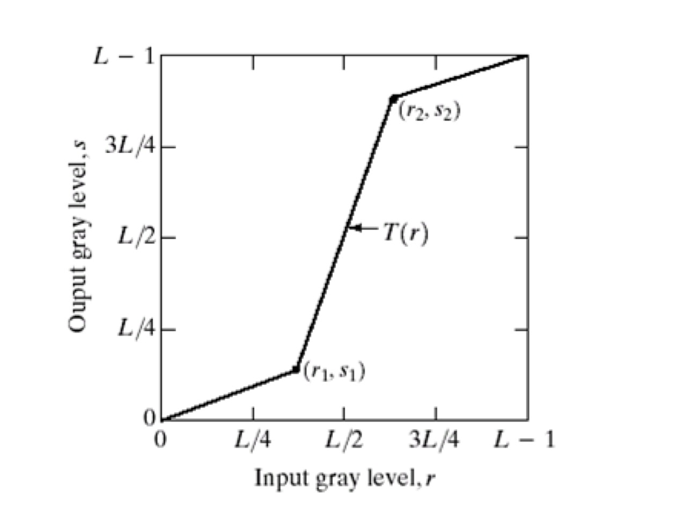

# 4412-lab-3

## 1. Perform thresholding on moon.bmp image to obtain the corresponding result in the presentation.
## 2. Use power law transformation with c=1 and γ = 0.6, 0.4, and 0.3 to obtain resulting images on fractured_spine.tif    image. (Do not forget to map the values to [0,1] range.)
## 3. Write a Matlab function output = stretch(input, r1, r2,s1,s2) that will perform the pixel transformation shown in figure given below.

## Use your stretch function to increase the contrast of the kids.tif image. Choose r1, s1 and r2, s2 so that the output image has a histogram which spans the full rangeofvaluesfrom0to255.Displaytheoutputimageanditshistogram. Hint: Use imhist function to display the histograms of the images.